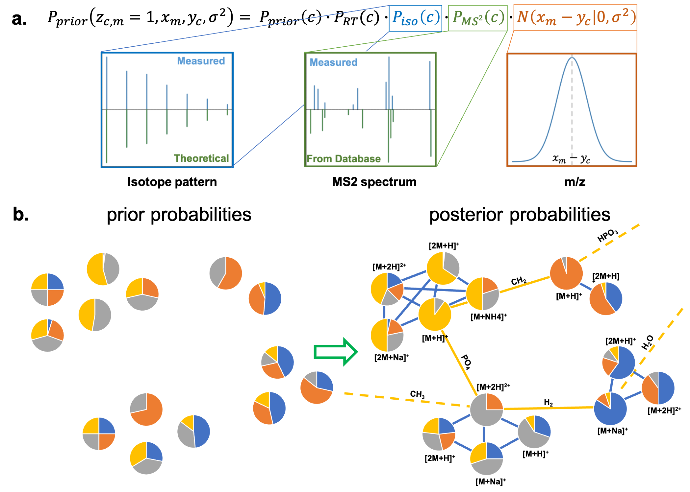

# ipaPy2
Python implementation of the Integrated Probabilistic Annotation (IPA) - A Bayesian annotation method for LC/MS data integrating biochemical relations,
isotope patterns and adduct formation.



## Installation
ipaPy2 requires Python 3.9 or higher

### Install via pip (recommended )
NOT THERE YET!

```
pip install ipaPy2
```

### Compiling from source (macOS)
1. create a folder in which you want to put the library
```
mkdir IPA
cd IPA
```
2. download the library. If Homebrew is not installed in your machine, you can install it from here https://brew.sh 
```
brew install git
```
```
git clone https://github.com/francescodc87/ipaPy2
cd ipaPy2
```
3. create and activate a virtual environment for your folder and install the necessary libraries
```
python3 -m venv ipaPy2
source ipaPy2/bin/activate
pip install wheel
pip install setuptools
pip install twine
pip install pytest==4.4.1
pip install pytest-runner==4.4
```
4. run tests (optional)
```
python setup.py pytest
```
5. build your library
```
python setup.py bdist_wheel
```
6. The wheel file will be stored in the \dist folder. You can install the library in a new terminal as follows
```
pip install /path/to/wheelfile.whl
```

### Compiling from source (Linux)
1. create a folder in which you want to put the library
```
mkdir IPA
cd IPA
```
2. download the library
```
sudo apt-get install git
git clone https://github.com/francescodc87/ipaPy2
cd ipaPy2
```
3. create and activate a virtual environment for your folder and install the necessary libraries
```
python3 -m venv ipaPy2
source ipaPy2/bin/activate
pip install wheel
pip install setuptools
pip install twine
pip install pytest==4.4.1
pip install pytest-runner==4.4
```
4. run tests (optional)
```
python setup.py pytest
```
5. build your library
```
python setup.py bdist_wheel
```
6. The wheel file will be stored in the \dist folder. You can install the library in a new terminal as follows
```
pip install /path/to/wheelfile.whl
```

### Compiling from source (Windows)
to be added

## Databases
One of the most powerful features of the IPA method is that it is able to integrate the knowledge gained from previous experiments in the annotation process. There are three files that are used as database:

**1. adducts file (required)**
<br />
The ipaPy2 library requires a file contains all the information required for the computation of the adducts. An adducts.csv file is provided with the package [here](DB/adducts.csv). The file contains the most common adducts. If any exotic adduct (or in-source fragment) needs to be considered, the user must modify the file accordingly. The format required for the adducts file is shown below. 


```python
import pandas as pd
import numpy as np
adducts = pd.read_csv('DB/adducts.csv')
adducts.head()
```


<div>

<table border="1" class="dataframe">
  <thead>
    <tr style="text-align: right;">
      <th></th>
      <th>name</th>
      <th>calc</th>
      <th>Charge</th>
      <th>Mult</th>
      <th>Mass</th>
      <th>Ion_mode</th>
      <th>Formula_add</th>
      <th>Formula_ded</th>
      <th>Multi</th>
    </tr>
  </thead>
  <tbody>
    <tr>
      <th>0</th>
      <td>M+H</td>
      <td>M+1.007276</td>
      <td>1</td>
      <td>1</td>
      <td>1.007276</td>
      <td>positive</td>
      <td>H1</td>
      <td>FALSE</td>
      <td>1</td>
    </tr>
    <tr>
      <th>1</th>
      <td>M+NH4</td>
      <td>M+18.033823</td>
      <td>1</td>
      <td>1</td>
      <td>18.033823</td>
      <td>positive</td>
      <td>N1H4</td>
      <td>FALSE</td>
      <td>1</td>
    </tr>
    <tr>
      <th>2</th>
      <td>M+Na</td>
      <td>M+22.989218</td>
      <td>1</td>
      <td>1</td>
      <td>22.989218</td>
      <td>positive</td>
      <td>Na1</td>
      <td>FALSE</td>
      <td>1</td>
    </tr>
    <tr>
      <th>3</th>
      <td>M+K</td>
      <td>M+38.963158</td>
      <td>1</td>
      <td>1</td>
      <td>38.963158</td>
      <td>positive</td>
      <td>K1</td>
      <td>FALSE</td>
      <td>1</td>
    </tr>
    <tr>
      <th>4</th>
      <td>M+</td>
      <td>M-0.00054858</td>
      <td>1</td>
      <td>1</td>
      <td>-0.000549</td>
      <td>positive</td>
      <td>FALSE</td>
      <td>FALSE</td>
      <td>1</td>
    </tr>
  </tbody>
</table>
</div>


**2. MS1 database file (required)**
<br />
The IPA method requires a pandas dataframe containing the database against which the annotation is performed.
Such dataframe must contain the following columns in this exact order (optional columns can have empty fields):
- **id**: unique id of the database entry (e.g., 'C00031') - *necessary*
- **name**: compound name (e.g., 'D-Glucose') - *necessary*
- **formula**: chemical formula (e.g., 'C6H12O6') - *necessary*
- **inchi**: inchi string - *optional*
- **smiles**: smiles string - *optional*
- **RT**: if known, retention time range (in seconds) where this compound is expected to elute (e.g., '30;60') - *optional*
- **adductsPos**: list of adducts that should be considered in positive mode for this entry (e.g.,'M+Na;M+H;M+') - *necessary*
- **adductsNeg**: list of adducts that should be considered in Negative mode for this entry (e.g.,'M-H;M-2H') - *necessary*
- **description**: comments on the entry - *optional*
- **pk**: previous knowledge on the likelihood of this compound to be present in the sample analyse. The value has to be between 1 (compound likely to be present in the sample) and 0 (compound cannot be present in the sample).
- **MS2**: id for the MS2 database entries related to this compound - *optional*
- **reactions**: list of reactions ids involving this compound (e.g., 'R00010 R00015 R00028'). If required, these can be used to find possible biochemical connections - *optional* 

The column names must be the ones reported here.
While the users are strongly advised to build their own *ad-hoc* database, [here](DB/IPA_MS1.csv) you can find a relatively big example database.


```python
DB = pd.read_csv('DB/IPA_MS1.csv')
DB.head()
```


<div>

<table border="1" class="dataframe">
  <thead>
    <tr style="text-align: right;">
      <th></th>
      <th>id</th>
      <th>name</th>
      <th>formula</th>
      <th>inchi</th>
      <th>smiles</th>
      <th>RT</th>
      <th>adductsPos</th>
      <th>adductsNeg</th>
      <th>description</th>
      <th>pk</th>
      <th>MS2</th>
      <th>reactions</th>
    </tr>
  </thead>
  <tbody>
    <tr>
      <th>0</th>
      <td>C00002</td>
      <td>ATP</td>
      <td>C10H16N5O13P3</td>
      <td>InChI=1S/C10H16N5O13P3/c11-8-5-9(13-2-12-8)15(...</td>
      <td>NaN</td>
      <td>NaN</td>
      <td>M+H;M+Na;M+2H;2M+H</td>
      <td>M-H;2M-H;M-2H;3M-H</td>
      <td>NaN</td>
      <td>1</td>
      <td>EMBL-MCF_spec365637_1</td>
      <td>R00002 R00076 R00085 R00086 R00087 R00088 R000...</td>
    </tr>
    <tr>
      <th>1</th>
      <td>C00003</td>
      <td>NAD+</td>
      <td>C21H28N7O14P2</td>
      <td>InChI=1S/C21H27N7O14P2/c22-17-12-19(25-7-24-17...</td>
      <td>NaN</td>
      <td>NaN</td>
      <td>M+H;M+Na;M+2H;2M+H</td>
      <td>M-H;2M-H;M-2H;3M-H</td>
      <td>NaN</td>
      <td>1</td>
      <td>EMBL-MCF_specxxxxx_10</td>
      <td>R00023 R00090 R00091 R00092 R00093 R00094 R000...</td>
    </tr>
    <tr>
      <th>2</th>
      <td>C00004</td>
      <td>NADH</td>
      <td>C21H29N7O14P2</td>
      <td>InChI=1S/C21H29N7O14P2/c22-17-12-19(25-7-24-17...</td>
      <td>NaN</td>
      <td>NaN</td>
      <td>M+H;M+Na;M+2H;2M+H</td>
      <td>M-H;2M-H;M-2H;3M-H</td>
      <td>NaN</td>
      <td>1</td>
      <td>NaN</td>
      <td>R00023 R00090 R00091 R00092 R00093 R00094 R000...</td>
    </tr>
    <tr>
      <th>3</th>
      <td>C00005</td>
      <td>NADPH</td>
      <td>C21H30N7O17P3</td>
      <td>InChI=1S/C21H30N7O17P3/c22-17-12-19(25-7-24-17...</td>
      <td>NaN</td>
      <td>NaN</td>
      <td>M+H;M+Na;M+2H;2M+H</td>
      <td>M-H;2M-H;M-2H;3M-H</td>
      <td>NaN</td>
      <td>1</td>
      <td>NaN</td>
      <td>R00105 R00106 R00107 R00108 R00109 R00111 R001...</td>
    </tr>
    <tr>
      <th>4</th>
      <td>C00006</td>
      <td>NADP+</td>
      <td>C21H29N7O17P3</td>
      <td>InChI=1S/C21H28N7O17P3/c22-17-12-19(25-7-24-17...</td>
      <td>NaN</td>
      <td>NaN</td>
      <td>M+H;M+Na;M+2H;2M+H</td>
      <td>M-H;2M-H;M-2H;3M-H</td>
      <td>NaN</td>
      <td>1</td>
      <td>EMBL-MCF_specxxxxxx_45</td>
      <td>R00104 R00106 R00107 R00108 R00109 R00111 R001...</td>
    </tr>
  </tbody>
</table>
</div>


This example databases was obtained considering the [KEGG database](https://www.genome.jp/kegg/compound/), the [Natural Products Atlas database](https://www.npatlas.org) and the [MoNa database](https://mona.fiehnlab.ucdavis.edu) (only compounds having at least one fragmentation spectra obtained with a QExactive).
For each entry, only a handful of the most common adducts is considered.
To fully exploit the IPA method, it is strongly recommended to constantly update the database when new knowledge is gained from previous experience. Providing a retention time window for compounds previously detected with the analytical system at hand it is particularly useful.
For the sake of the example in this tutorial, a reduced example database is also provided.


```python
DB = pd.read_csv('DB/DB_test_pos.csv')
DB.head()
```


<div>

<table border="1" class="dataframe">
  <thead>
    <tr style="text-align: right;">
      <th></th>
      <th>id</th>
      <th>name</th>
      <th>formula</th>
      <th>inchi</th>
      <th>smiles</th>
      <th>RT</th>
      <th>adductsPos</th>
      <th>adductsNeg</th>
      <th>description</th>
      <th>pk</th>
      <th>MS2</th>
      <th>reactions</th>
    </tr>
  </thead>
  <tbody>
    <tr>
      <th>0</th>
      <td>C00079</td>
      <td>L-Phenylalanine</td>
      <td>C9H11NO2</td>
      <td>InChI=1S/C9H11NO2/c10-8(9(11)12)6-7-4-2-1-3-5-...</td>
      <td>NaN</td>
      <td>120;160</td>
      <td>M+H;M+Na;M+2H;2M+H</td>
      <td>M-H;2M-H;M-2H;3M-H</td>
      <td>NaN</td>
      <td>1</td>
      <td>UA005501_1</td>
      <td>R00686 R00688 R00689 R00690 R00691 R00692 R006...</td>
    </tr>
    <tr>
      <th>1</th>
      <td>C00082</td>
      <td>L-Tyrosine</td>
      <td>C9H11NO3</td>
      <td>InChI=1S/C9H11NO3/c10-8(9(12)13)5-6-1-3-7(11)4...</td>
      <td>NaN</td>
      <td>50;90</td>
      <td>M+H;M+Na;M+2H;2M+H</td>
      <td>M-H;2M-H;M-2H;3M-H</td>
      <td>NaN</td>
      <td>1</td>
      <td>UA005601_1</td>
      <td>R00031 R00728 R00729 R00730 R00731 R00732 R007...</td>
    </tr>
    <tr>
      <th>2</th>
      <td>C00114</td>
      <td>Choline</td>
      <td>C5H14NO</td>
      <td>InChI=1S/C5H14NO/c1-6(2,3)4-5-7/h7H,4-5H2,1-3H...</td>
      <td>NaN</td>
      <td>NaN</td>
      <td>M+H;M+Na;M+2H;2M+H</td>
      <td>M-H;2M-H;M-2H;3M-H</td>
      <td>NaN</td>
      <td>1</td>
      <td>NaN</td>
      <td>R01021 R01022 R01023 R01025 R01026 R01027 R010...</td>
    </tr>
    <tr>
      <th>3</th>
      <td>C00123</td>
      <td>L-Leucine</td>
      <td>C6H13NO2</td>
      <td>InChI=1S/C6H13NO2/c1-4(2)3-5(7)6(8)9/h4-5H,3,7...</td>
      <td>NaN</td>
      <td>70;110</td>
      <td>M+H;M+Na;M+2H;2M+H</td>
      <td>M-H;2M-H;M-2H;3M-H</td>
      <td>NaN</td>
      <td>1</td>
      <td>NaN</td>
      <td>R01088 R01089 R01090 R01091 R02552 R03657 R084...</td>
    </tr>
    <tr>
      <th>4</th>
      <td>C00148</td>
      <td>L-Proline</td>
      <td>C5H9NO2</td>
      <td>InChI=1S/C5H9NO2/c7-5(8)4-2-1-3-6-4/h4,6H,1-3H...</td>
      <td>NaN</td>
      <td>35;55</td>
      <td>M+H;M+Na;M+2H;2M+H</td>
      <td>M-H;2M-H;M-2H;3M-H</td>
      <td>NaN</td>
      <td>1</td>
      <td>EMBL-MCF_specxxxxx_7</td>
      <td>R00135 R00671 R01246 R01248 R01249 R01251 R012...</td>
    </tr>
  </tbody>
</table>
</div>


**3. MS2 database file (only required is MS2 data is available)**
<br />
This new implementation of the IPA method also allows the user to include MS2 data in the annotation pipeline.
In order to exploit this functionality a MS2 spectra database must be provided.
The MS2 database must be provided as a pandas dataframe including the following columns in this exact order:
- **compound_id**: unique id for each compound, it must match with the ids used in the MS1 database - *necessary*
- **id**: Unique id for the single entry (i.e., spectra) of the database *necessary*
- **name**: compound name (e.g., 'D-Glucose') - *necessary*
- **formula**: chemical formula (e.g., 'C6H12O6') - *necessary*
- **inchi**: inchi string - *optional*
- **precursorType**: the adduct form of the precursor ion (e.g., 'M+H') - *necessary*
- **instrument**: the type of instrument the spectrum was acquired with - *optional*
- **collision.energy**: the collision energy level used to acquire the spectrum (e.g., '15') - *necessary*
- **spectrum**: The actual spectrum in the form of a string in the following format 'mz1:Int1 mz2:Int2 mz3:Int3 ...'

It is necessary that the user uses a MS2 database specific to the instrument used to acquire the data.
The MS2 database found [here](https://drive.google.com/file/d/15qduvtE8aSAAUCf1FE4ojcVLaTw-B2W6/view?usp=sharing), contains all the MS2 spectra found in the [MoNa](https://mona.fiehnlab.ucdavis.edu) database acquired with a QExactive. This is a relatively big file, and for the sake of this tutorial a drastically reduced version of it has been included within this repository, and can be found [here](DB/DBMS2_test_pos.csv).


```python
DBMS2 = pd.read_csv('DB/DBMS2_test_pos.csv')
DBMS2.head()
```


<div>

<table border="1" class="dataframe">
  <thead>
    <tr style="text-align: right;">
      <th></th>
      <th>compound_id</th>
      <th>id</th>
      <th>name</th>
      <th>formula</th>
      <th>inchi</th>
      <th>precursorType</th>
      <th>instrument</th>
      <th>collision.energy</th>
      <th>spectrum</th>
    </tr>
  </thead>
  <tbody>
    <tr>
      <th>0</th>
      <td>EMBL-MCF_specxxxxxx_11</td>
      <td>EMBL-MCF_spec103039</td>
      <td>L-valine</td>
      <td>C5H11NO2</td>
      <td>InChI=1S/C5H11NO2/c1-3(2)4(6)5(7)8/h3-4H,6H2,1...</td>
      <td>M+H</td>
      <td>Thermo Q-Exactive Plus</td>
      <td>35</td>
      <td>55.0550575256:5.821211 57.0581207275:0.385600 ...</td>
    </tr>
    <tr>
      <th>1</th>
      <td>EMBL-MCF_specxxxxxx_11</td>
      <td>EMBL-MCF_spec353465</td>
      <td>L-valine</td>
      <td>C5H11NO2</td>
      <td>InChI=1S/C5H11NO2/c1-3(2)4(6)5(7)8/h3-4H,6H2,1...</td>
      <td>M+H</td>
      <td>Thermo Q-Exactive Plus</td>
      <td>30</td>
      <td>49.5028053042:0.000000 49.5031356971:0.000000 ...</td>
    </tr>
    <tr>
      <th>2</th>
      <td>EMBL-MCF_specxxxxxx_11</td>
      <td>EMBL-MCF_spec27828</td>
      <td>L-valine</td>
      <td>C5H11NO2</td>
      <td>InChI=1S/C5H11NO2/c1-3(2)4(6)5(7)8/h3-4H,6H2,1...</td>
      <td>M-H</td>
      <td>Thermo Q-Exactive Plus</td>
      <td>35</td>
      <td>55.0173454285:0.819357 58.0282363892:0.155430 ...</td>
    </tr>
    <tr>
      <th>3</th>
      <td>EMBL-MCF_specxxxxx_7</td>
      <td>EMBL-MCF_spec96902</td>
      <td>L-proline</td>
      <td>C5H9NO2</td>
      <td>InChI=1S/C5H9NO2/c7-5(8)4-2-1-3-6-4/h4,6H,1-3H...</td>
      <td>M+H</td>
      <td>Thermo Q-Exactive Plus</td>
      <td>35</td>
      <td>50.5765228271:0.040013 51.3066940308:0.039949 ...</td>
    </tr>
    <tr>
      <th>4</th>
      <td>EMBL-MCF_specxxxxx_7</td>
      <td>EMBL-MCF_spec353568</td>
      <td>L-proline</td>
      <td>C5H9NO2</td>
      <td>InChI=1S/C5H9NO2/c7-5(8)4-2-1-3-6-4/h4,6H,1-3H...</td>
      <td>M+H</td>
      <td>Thermo Q-Exactive Plus</td>
      <td>30</td>
      <td>49.5028215674:0.000000 49.5031519602:0.000000 ...</td>
    </tr>
  </tbody>
</table>
</div>


## Data preparation
Before using the ipaPy2 package, the processed data coming from an untargeted metabolomics experiment must be properly prepared.

**1. MS1 data**

The data must be organized in a pandas dataframe containing the following columns:
- **ids**: an unique numeric id for each mass spectrometry feature feature
- **rel.ids**: relation ids. Features must be clustered based on correlation/peak shape/retention time. Features in the same cluster are likely to come from the same metabolite.
- **mzs**: mass-to-charge ratios, usually the average across different samples.
- **RTs**: retention times in seconds, usually the average across different samples.
- **Int**: representative (e.g., maximum or average) intensity detected for each feature across samples (either peak area or peak intensity)


Below is reported an example:


```python
df1=pd.read_csv('ExampleDatasets/README/df_test_pos.csv')
df1.head()
```


<div>

<table border="1" class="dataframe">
  <thead>
    <tr style="text-align: right;">
      <th></th>
      <th>ids</th>
      <th>rel.ids</th>
      <th>mzs</th>
      <th>RTs</th>
      <th>Int</th>
    </tr>
  </thead>
  <tbody>
    <tr>
      <th>0</th>
      <td>1</td>
      <td>0</td>
      <td>116.070544</td>
      <td>45.770423</td>
      <td>2.170017e+09</td>
    </tr>
    <tr>
      <th>1</th>
      <td>88</td>
      <td>0</td>
      <td>117.073678</td>
      <td>45.787586</td>
      <td>1.256520e+08</td>
    </tr>
    <tr>
      <th>2</th>
      <td>501</td>
      <td>0</td>
      <td>231.133673</td>
      <td>46.183948</td>
      <td>2.519223e+07</td>
    </tr>
    <tr>
      <th>3</th>
      <td>4429</td>
      <td>0</td>
      <td>232.136923</td>
      <td>46.176715</td>
      <td>2.635594e+06</td>
    </tr>
    <tr>
      <th>4</th>
      <td>2</td>
      <td>1</td>
      <td>104.106830</td>
      <td>40.843309</td>
      <td>1.889172e+09</td>
    </tr>
  </tbody>
</table>
</div>


The clustering of the features is a necessary and must be performed before running the IPA method. For this step, the use of widely used data processing software such as [mzMatch](https://github.com/UoMMIB/mzmatch.R) and [CAMERA](https://bioconductor.org/packages/release/bioc/html/CAMERA.html) is recommended.
Nevertheless, the ipaPy2 library provides a function (clusterFeatures()) able to perform such step, starting from a dataframe containing the measured intensities across several samples (at least 3 samples, the more samples the better). 
Such dataframe should be organized as follows:


```python
df2=pd.read_csv('ExampleDatasets/README/df_test_pos_not_clustered.csv')
df2.head()
```


<div>

<table border="1" class="dataframe">
  <thead>
    <tr style="text-align: right;">
      <th></th>
      <th>ids</th>
      <th>mzs</th>
      <th>RTs</th>
      <th>sample1</th>
      <th>sample2</th>
      <th>sample3</th>
      <th>sample4</th>
      <th>sample5</th>
      <th>sample6</th>
      <th>sample7</th>
      <th>sample8</th>
      <th>sample9</th>
      <th>sample10</th>
    </tr>
  </thead>
  <tbody>
    <tr>
      <th>0</th>
      <td>1</td>
      <td>116.070544</td>
      <td>45.770423</td>
      <td>1.003660e+09</td>
      <td>1.299828e+09</td>
      <td>1.878029e+09</td>
      <td>1.778238e+09</td>
      <td>1.715394e+09</td>
      <td>4.340034e+08</td>
      <td>1.586635e+09</td>
      <td>2.170017e+09</td>
      <td>1.312151e+09</td>
      <td>2.051875e+09</td>
    </tr>
    <tr>
      <th>1</th>
      <td>2</td>
      <td>104.106830</td>
      <td>40.843309</td>
      <td>3.778343e+08</td>
      <td>8.721901e+08</td>
      <td>8.353805e+08</td>
      <td>1.889172e+09</td>
      <td>1.114844e+09</td>
      <td>1.296362e+09</td>
      <td>7.361379e+08</td>
      <td>7.386887e+08</td>
      <td>9.546864e+08</td>
      <td>6.969054e+08</td>
    </tr>
    <tr>
      <th>2</th>
      <td>3</td>
      <td>118.085998</td>
      <td>43.584638</td>
      <td>5.984715e+08</td>
      <td>1.399106e+09</td>
      <td>2.831220e+08</td>
      <td>1.415610e+09</td>
      <td>7.557607e+08</td>
      <td>7.800359e+08</td>
      <td>8.949854e+08</td>
      <td>5.074069e+08</td>
      <td>6.854525e+08</td>
      <td>1.000501e+09</td>
    </tr>
    <tr>
      <th>3</th>
      <td>4</td>
      <td>166.086047</td>
      <td>143.321396</td>
      <td>1.390905e+09</td>
      <td>1.047887e+09</td>
      <td>1.053413e+09</td>
      <td>2.781809e+08</td>
      <td>1.037486e+09</td>
      <td>1.117700e+09</td>
      <td>6.153332e+08</td>
      <td>1.215932e+09</td>
      <td>1.264092e+09</td>
      <td>1.370995e+09</td>
    </tr>
    <tr>
      <th>4</th>
      <td>5</td>
      <td>132.101745</td>
      <td>89.387202</td>
      <td>6.071912e+08</td>
      <td>1.014152e+09</td>
      <td>1.270735e+09</td>
      <td>1.069765e+09</td>
      <td>4.925938e+08</td>
      <td>4.087633e+08</td>
      <td>3.777945e+08</td>
      <td>2.541470e+08</td>
      <td>8.025257e+08</td>
      <td>3.544281e+08</td>
    </tr>
  </tbody>
</table>
</div>


```python
from ipaPy2 import ipa
df=ipa.clusterFeatures(df2)
```

    Clustering features ....
    0.0 seconds elapsed


All information about the function can be found in the help of the function


```python
help(ipa.clusterFeatures)
```

    Help on function clusterFeatures in module ipaPy2.ipa:
    
    clusterFeatures(df, Cthr=0.8, RTwin=1, Intmode='max')
        Clustering MS1 features based on correlation across samples.
        
        Parameters
        ----------
        df: pandas dataframe with the following columns:
            -ids: a unique id for each feature
            -mzs: mass-to-charge ratios, usually the average across different
                  samples.
            -RTs: retention times in seconds, usually the average across different
                  samples.
            -Intensities: for each sample, a column reporting the detected
                          intensities in each sample. 
        Cthr: Default value 0.8. Minimum correlation allowed in each cluster
        RTwin: Default value 1. Maximum difference in RT time between features in
               the same cluster
        Intmode: Defines how the representative intensity of each feature is
                 computed. If 'max' (default) the maximum across samples is used.
                 If 'ave' the average across samples is computed
        Returns
        -------
        df: pandas dataframe in correct format to be used as an input of the
        map_isotope_patterns() function
    


After running, this function returns a pandas dataframe in the correct format for the ipaPy2 package


```python
df.head()
```


<div>

<table border="1" class="dataframe">
  <thead>
    <tr style="text-align: right;">
      <th></th>
      <th>ids</th>
      <th>rel.ids</th>
      <th>mzs</th>
      <th>RTs</th>
      <th>Int</th>
    </tr>
  </thead>
  <tbody>
    <tr>
      <th>0</th>
      <td>1</td>
      <td>0</td>
      <td>116.070544</td>
      <td>45.770423</td>
      <td>2.170017e+09</td>
    </tr>
    <tr>
      <th>1</th>
      <td>88</td>
      <td>0</td>
      <td>117.073678</td>
      <td>45.787586</td>
      <td>1.256520e+08</td>
    </tr>
    <tr>
      <th>2</th>
      <td>501</td>
      <td>0</td>
      <td>231.133673</td>
      <td>46.183948</td>
      <td>2.519223e+07</td>
    </tr>
    <tr>
      <th>3</th>
      <td>4429</td>
      <td>0</td>
      <td>232.136923</td>
      <td>46.176715</td>
      <td>2.635594e+06</td>
    </tr>
    <tr>
      <th>4</th>
      <td>2</td>
      <td>1</td>
      <td>104.106830</td>
      <td>40.843309</td>
      <td>1.889172e+09</td>
    </tr>
  </tbody>
</table>
</div>


**2. MS2 data**

If fragmentation data was acquired during the experiment, it can be included in the IPA annotation process.
To do so, the data must be organized in a pandas dataframe containing the following columns:
- **id**: an unique id for each feature for which the MS2 spectrum was acquired (same as in MS1)
- **spectrum**: string containing the spectrum inforamtion in the following format 'mz1:Int1 mz2:Int2 mz3:Int3 ...'
- **ev**: collision energy used to aquire the fragmentation spectrum

Below is reported an example:


```python
dfMS2=pd.read_csv('ExampleDatasets/README/MS2data_example.csv')
dfMS2.head()
```


<div>

<table border="1" class="dataframe">
  <thead>
    <tr style="text-align: right;">
      <th></th>
      <th>id</th>
      <th>spectrum</th>
      <th>ev</th>
    </tr>
  </thead>
  <tbody>
    <tr>
      <th>0</th>
      <td>1</td>
      <td>51.3066132836457:0.884272376680125 59.96532241...</td>
      <td>35</td>
    </tr>
    <tr>
      <th>1</th>
      <td>1</td>
      <td>51.3066132836457:0.884272376680125 59.96532241...</td>
      <td>15</td>
    </tr>
    <tr>
      <th>2</th>
      <td>90</td>
      <td>62.4153253406374:0.743812036877455 63.93291389...</td>
      <td>35</td>
    </tr>
    <tr>
      <th>3</th>
      <td>992</td>
      <td>50.983321052233:0.973529955385613 53.039006800...</td>
      <td>35</td>
    </tr>
    <tr>
      <th>4</th>
      <td>3</td>
      <td>55.0551847656264:5.67780579195993 57.058126021...</td>
      <td>35</td>
    </tr>
  </tbody>
</table>
</div>


## Usage
The Integrated Probabilistic Annotation (IPA) method can be applied in different situations, and the ipaPy2 package allow the users to taylor the IPA pipeline around their specific needs.

This brief tutorial describes the most common scenarios the IPA method can be applied to.

**1. Mapping isotope patterns**

The first step of the IPA pipeline consists in the mapping of the isotope patterns within the dataset considered. This is achieved through the map_isotope_patterns(). The help of this function provides a detailed description of it.


```python
help(ipa.map_isotope_patterns)
```

    Help on function map_isotope_patterns in module ipaPy2.ipa:
    
    map_isotope_patterns(df, isoDiff=1, ppm=100, ionisation=1)
        mapping isotope patterns in MS1 data.
        
        Parameters
        ----------
        df : pandas dataframe (necessary)
             A dataframe containing the MS1 data including the following columns:
                -ids: an unique id for each feature
                -rel.ids:   relation ids. In a previous step of the data processing
                            pipeline, features are clustered based on peak shape
                            similarity/retention time. Features in the same
                            cluster are likely to come from the same metabolite.
                            All isotope patterns must be in the same rel.id
                            cluster.
                -mzs: mass-to-charge ratios, usually the average across
                      different samples.
                -RTs: retention times in seconds, usually the average across
                      different samples.
                -Ints: representative (e.g., maximum or average) intensity detected
                       for each feature across samples (either peak area or peak
                       intensity)
        isoDiff : Default value 1. Difference between isotopes of charge 1, does
                  not need to be exact
        ppm:   Default value 100. Maximum ppm value allowed between 2 isotopes.
                It is very high on purpose
        ionisation: Default value 1. positive = 1, negative = -1
        
        Returns
        -------
        df: the main input is modified by adding and populating the following
            columns
            - relationship: the possible values are:
                            * bp: basepeak, most intense peak within each rel id
                            * bp|isotope: isotope of the basepeak
                            * potential bp: most intense peak within each isotope
                                            pattern (excluding the basepeak)
                            * potential bp|isotope: isotope of one potential bp
            - isotope pattern: feature used to cluster the different isotope
                                patterns within the same relation id
            - charge: predicted charge based on the isotope pattern (1,2,3,4,5 or
                      -1,-2,-3,-4,-5 are the only values allowed)
    


For the sake of this tutorial, the small dataset example introduced above is considered.


```python
ipa.map_isotope_patterns(df,ionisation=1)
```

    mapping isotope patterns ....
    0.1 seconds elapsed


Once finished, this function modifies the pandas dataframe provided as input annotating all isotope patterns.


```python
df.head()
```


<div>

<table border="1" class="dataframe">
  <thead>
    <tr style="text-align: right;">
      <th></th>
      <th>ids</th>
      <th>rel.ids</th>
      <th>mzs</th>
      <th>RTs</th>
      <th>Int</th>
      <th>relationship</th>
      <th>isotope pattern</th>
      <th>charge</th>
    </tr>
  </thead>
  <tbody>
    <tr>
      <th>0</th>
      <td>1</td>
      <td>0</td>
      <td>116.070544</td>
      <td>45.770423</td>
      <td>2.170017e+09</td>
      <td>bp</td>
      <td>0</td>
      <td>1</td>
    </tr>
    <tr>
      <th>1</th>
      <td>88</td>
      <td>0</td>
      <td>117.073678</td>
      <td>45.787586</td>
      <td>1.256520e+08</td>
      <td>bp|isotope</td>
      <td>0</td>
      <td>1</td>
    </tr>
    <tr>
      <th>2</th>
      <td>501</td>
      <td>0</td>
      <td>231.133673</td>
      <td>46.183948</td>
      <td>2.519223e+07</td>
      <td>potential bp</td>
      <td>1</td>
      <td>1</td>
    </tr>
    <tr>
      <th>3</th>
      <td>4429</td>
      <td>0</td>
      <td>232.136923</td>
      <td>46.176715</td>
      <td>2.635594e+06</td>
      <td>potential bp|isotope</td>
      <td>1</td>
      <td>1</td>
    </tr>
    <tr>
      <th>4</th>
      <td>2</td>
      <td>1</td>
      <td>104.106830</td>
      <td>40.843309</td>
      <td>1.889172e+09</td>
      <td>bp</td>
      <td>0</td>
      <td>1</td>
    </tr>
  </tbody>
</table>
</div>


Some data processing pipelines already have a isotope mapping function and the user can used them as long as they organise the data in the correct format

**2. Compute all adducts**

The second step of the pipeline consists in the calculation of all possible adducts that could be generated by the compounds included in the database.
This is done by the function compute_all_adducts(). This function comes with a very detailed help.


```python
help(ipa.compute_all_adducts)
```

    Help on function compute_all_adducts in module ipaPy2.ipa:
    
    compute_all_adducts(adductsAll, DB, ionisation=1, ncores=1)
        compute all adducts table based on the information present in the database
        
        Parameters
        ----------
        adductsAll : pandas dataframe (necessary)
                     Dataframe containing information on all possible
                     adducts. The file must be in the same format as the example
                     provided in the DB/adducts.csv
        DB : pandas dataframe (necessary)
             Dataframe containing the database against which the annotation is
             performed. The DB must contain the following columns in this exact
             order (optional fields can contain None):
                 - id: unique id of the database entry (e.g., 'C00031') - necessary
                 - name: compound name (e.g., 'D-Glucose') - necessary
                 - formula: chemical formula (e.g., 'C6H12O6') - necessary
                 - inchi: inchi string - optional
                 - smiles: smiles string - optional
                 - RT: if known, retention time range (in seconds) where this
                       compound is expected to elute (e.g., '30;60') - optional
                 - adductsPos: list of adducts that should be considered in
                               positive mode for this entry (e.g.,'M+Na;M+H;M+')
                 - adductsNeg: list of adducts that should be considered in
                               negative mode for this entry (e.g.,'M-H;M-2H')
                 - description: comments on the entry - optional
                 - pk: previous knowledge on the likelihood of this compound to be
                       present in the sample analysed. The value has to be between
                       1 (compound likely to be present in the sample) and 0
                       (compound cannot be present in the sample).
                 - MS2: id for the MS2 database entries related to this compound
                        (optional)
                 - reactions: list of reactions ids involving this compound
                              (e.g., 'R00010 R00015 R00028')-optional 
        ionisation : Default value 1. positive = 1, negative = -1
        ncores : default value 1. Number of cores used
        
        Returns
        -------
        allAdds: pandas dataframe containing the information on all the possible
        adducts given the database.
    


Depending on the size of the dataset used (i.e., number of compounds included), this step can become rather time-consuming, and the use of multiple cores should be considered.
In the context of this tutorial, the heavily reduced example dataset introduced before is considered.


```python
allAddsPos = ipa.compute_all_adducts(adducts, DB, ionisation=1, ncores=1)
```

    computing all adducts ....
    0.1 seconds elapsed


```python
allAddsPos.head()
```


<div>

<table border="1" class="dataframe">
  <thead>
    <tr style="text-align: right;">
      <th></th>
      <th>id</th>
      <th>name</th>
      <th>adduct</th>
      <th>formula</th>
      <th>charge</th>
      <th>m/z</th>
      <th>RT</th>
      <th>pk</th>
      <th>MS2</th>
    </tr>
  </thead>
  <tbody>
    <tr>
      <th>0</th>
      <td>C00079</td>
      <td>L-Phenylalanine</td>
      <td>M+H</td>
      <td>C9H12NO2</td>
      <td>1</td>
      <td>166.086255</td>
      <td>120;160</td>
      <td>1</td>
      <td>UA005501_1</td>
    </tr>
    <tr>
      <th>1</th>
      <td>C00079</td>
      <td>L-Phenylalanine</td>
      <td>M+Na</td>
      <td>C9H11NNaO2</td>
      <td>1</td>
      <td>188.068197</td>
      <td>120;160</td>
      <td>1</td>
      <td>UA005501_1</td>
    </tr>
    <tr>
      <th>2</th>
      <td>C00079</td>
      <td>L-Phenylalanine</td>
      <td>M+2H</td>
      <td>C9H13NO2</td>
      <td>2</td>
      <td>83.546765</td>
      <td>120;160</td>
      <td>1</td>
      <td>UA005501_1</td>
    </tr>
    <tr>
      <th>3</th>
      <td>C00079</td>
      <td>L-Phenylalanine</td>
      <td>2M+H</td>
      <td>C18H23N2O4</td>
      <td>1</td>
      <td>331.165233</td>
      <td>120;160</td>
      <td>1</td>
      <td>UA005501_1</td>
    </tr>
    <tr>
      <th>4</th>
      <td>C00082</td>
      <td>L-Tyrosine</td>
      <td>M+H</td>
      <td>C9H12NO3</td>
      <td>1</td>
      <td>182.081169</td>
      <td>50;90</td>
      <td>1</td>
      <td>UA005601_1</td>
    </tr>
  </tbody>
</table>
</div>


If the same database is used for subsequent experiments without introducing new information, it is recommended to save the results of this function into a .csv file. Therefore, the user would need to repeat this step in the future only if the DB changed.

**3. Annotation based on MS1 information**

At this point, the actual annotation process can start. If no fragmentation data is available, the MS1annotation() function should be used. This function annotates the dataset using the MS1 data and the information stored in the dataset. A detailed description of the function can be accessed through the help:


```python
help(ipa.MS1annotation)
```

    Help on function MS1annotation in module ipaPy2.ipa:
    
    MS1annotation(df, allAdds, ppm, me=0.000548579909065, ratiosd=0.9, ppmunk=None, ratiounk=None, ppmthr=None, pRTNone=None, pRTout=None, ncores=1)
        Annotation of the dataset base on the MS1 information. Prior probabilities
        are based on mass only, while post probabilities are based on mass, RT,
        previous knowledge and isotope patterns.
        
        Parameters
        ----------
        df: pandas dataframe containing the MS1 data. It should be the output of the
            function ipa.map_isotope_patterns()
        allAdds: pandas dataframe containing the information on all the possible
                adducts given the database. It should be the output of either
                ipa.compute_all_adducts() or ipa.compute_all_adducts_Parallel()
        ppm: accuracy of the MS instrument used
        me: accurate mass of the electron. Default 5.48579909065e-04
        ratiosd: default 0.9. It represents the acceptable ratio between predicted
                 intensity and observed intensity of isotopes. It is used to compute
                 the shape parameters of the lognormal distribution used to
                 calculate the isotope pattern scores as sqrt(1/ratiosd)
        ppmunk: ppm associated to the 'unknown' annotation. If not provided equal
                to ppm.
        ratiounk: isotope ratio associated to the 'unknown' annotation. If not
                  provided equal to 0.5
        ppmthr: Maximum ppm possible for the annotations. Ff not provided equal to
                2*ppm
        pRTNone: Multiplicative factor for the RT if no RTrange present in the
                 database. If not provided equal to 0.8
        pRTout: Multiplicative factor for the RT if measured RT is outside the
                RTrange present in the database. If not provided equal to 0.4
        ncores: default value 1. Number of cores used
        
        Returns
        -------
        annotations: a dictionary containing all the possible annotations for the
                    measured features. The keys of the dictionary are the unique
                    ids for the features present in df. For each feature, the
                    annotations are summarized in a pandas dataframe.
    


```python
annotations=ipa.MS1annotation(df,allAddsPos,ppm=3,ncores=1)
```

    annotating based on MS1 information....
    0.9 seconds elapsed


This function returns all the possible annotations for all the mass spectrometry features (excluding the ones previously identified as isotopes). The annotations are provided in the form of a dictionary.  The keys of the dictionary are the unique ids for the features present in df.
For each feature, all possible annotations are summarised in a dataframe including the following information:

- **id:** Unique id associated with the compound as reported in the database
- **name:** Name of the compound
- **formula:** Chemical formula of the putative annotation
- **adduct:** Adduct type
- **mz:** Theoretical m/z associated with the specific ion
- **charge:** Theoretical charge of the ion
- **RT range:** Retention time range reported in the database for the specific compound
- **ppm:** mass accuracy
- **isotope pattern score:** Score representing how similar the measured and theoretical isopattern scores are
- **fragmentation pattern score:** Cosine similarity. Empty in this case as no MS2 data was provided
- **prior:** Probabilities associated with each possible annotation computed by only considering the mz values (i.e., only considering ppm)
- **post:** Probabilities associated with each possible annotation computed by integrating all the additional information available: retention time range, ppm, isotope pattern score and prior knowledge.

As an example, possible annotations for the feature associated with id=1 is shown below:


```python
annotations[1]
```


<div>

<table border="1" class="dataframe">
  <thead>
    <tr style="text-align: right;">
      <th></th>
      <th>id</th>
      <th>name</th>
      <th>formula</th>
      <th>adduct</th>
      <th>m/z</th>
      <th>charge</th>
      <th>RT range</th>
      <th>ppm</th>
      <th>isotope pattern score</th>
      <th>fragmentation pattern score</th>
      <th>prior</th>
      <th>post</th>
    </tr>
  </thead>
  <tbody>
    <tr>
      <th>0</th>
      <td>C00148</td>
      <td>L-Proline</td>
      <td>C5H10NO2</td>
      <td>M+H</td>
      <td>116.070605</td>
      <td>1</td>
      <td>35;55</td>
      <td>-0.523247</td>
      <td>0.331946</td>
      <td>None</td>
      <td>0.318084</td>
      <td>0.454248</td>
    </tr>
    <tr>
      <th>1</th>
      <td>C00763</td>
      <td>D-Proline</td>
      <td>C5H10NO2</td>
      <td>M+H</td>
      <td>116.070605</td>
      <td>1</td>
      <td>None</td>
      <td>-0.523247</td>
      <td>0.331946</td>
      <td>None</td>
      <td>0.318084</td>
      <td>0.363398</td>
    </tr>
    <tr>
      <th>2</th>
      <td>C18170</td>
      <td>3-Acetamidopropanal</td>
      <td>C5H10NO2</td>
      <td>M+H</td>
      <td>116.070605</td>
      <td>1</td>
      <td>500;560</td>
      <td>-0.523247</td>
      <td>0.331946</td>
      <td>None</td>
      <td>0.318084</td>
      <td>0.181699</td>
    </tr>
    <tr>
      <th>3</th>
      <td>Unknown</td>
      <td>Unknown</td>
      <td>None</td>
      <td>None</td>
      <td>None</td>
      <td>None</td>
      <td>None</td>
      <td>3.000000</td>
      <td>0.004161</td>
      <td>None</td>
      <td>0.045748</td>
      <td>0.000655</td>
    </tr>
  </tbody>
</table>
</div>


It should be noticed that in this example, the prior probabilities associated with L-Proline M+H, D-Proline M+H and 3-Acetamidopropanal are exactly the same. This is because all three ions have exactly the same theoretical mass.
However, the post probabilities are different. This is because the retention time associated with this feature is within the retention range reported in the database for L-Proline and outside the one reported for 3-Acetamidopropanal.

Here another example:


```python
annotations[999]
```


<div>

<table border="1" class="dataframe">
  <thead>
    <tr style="text-align: right;">
      <th></th>
      <th>id</th>
      <th>name</th>
      <th>formula</th>
      <th>adduct</th>
      <th>m/z</th>
      <th>charge</th>
      <th>RT range</th>
      <th>ppm</th>
      <th>isotope pattern score</th>
      <th>fragmentation pattern score</th>
      <th>prior</th>
      <th>post</th>
    </tr>
  </thead>
  <tbody>
    <tr>
      <th>0</th>
      <td>C00079</td>
      <td>L-Phenylalanine</td>
      <td>C18H23N2O4</td>
      <td>2M+H</td>
      <td>331.165233</td>
      <td>1</td>
      <td>120;160</td>
      <td>-0.941814</td>
      <td>0.472049</td>
      <td>None</td>
      <td>0.240106</td>
      <td>0.550778</td>
    </tr>
    <tr>
      <th>1</th>
      <td>C02265</td>
      <td>D-Phenylalanine</td>
      <td>C18H23N2O4</td>
      <td>2M+H</td>
      <td>331.165233</td>
      <td>1</td>
      <td>None</td>
      <td>-0.941814</td>
      <td>0.472049</td>
      <td>None</td>
      <td>0.240106</td>
      <td>0.440622</td>
    </tr>
    <tr>
      <th>2</th>
      <td>Unknown</td>
      <td>Unknown</td>
      <td>None</td>
      <td>None</td>
      <td>None</td>
      <td>None</td>
      <td>None</td>
      <td>3.000000</td>
      <td>0.055901</td>
      <td>None</td>
      <td>0.039575</td>
      <td>0.008600</td>
    </tr>
    <tr>
      <th>3</th>
      <td>C03263</td>
      <td>Coproporphyrinogen III</td>
      <td>C36H46N4O8</td>
      <td>M+2H</td>
      <td>331.165233</td>
      <td>2</td>
      <td>None</td>
      <td>-0.941814</td>
      <td>0.000000</td>
      <td>None</td>
      <td>0.240106</td>
      <td>0.000000</td>
    </tr>
    <tr>
      <th>4</th>
      <td>C05768</td>
      <td>Coproporphyrinogen I</td>
      <td>C36H46N4O8</td>
      <td>M+2H</td>
      <td>331.165233</td>
      <td>2</td>
      <td>None</td>
      <td>-0.941814</td>
      <td>0.000000</td>
      <td>None</td>
      <td>0.240106</td>
      <td>0.000000</td>
    </tr>
  </tbody>
</table>
</div>


Also in this case, all the prior probabilities associated with the four ions are exactly the same since all the ions have the same theoretical mass-to-charge ratios. However, the post probabilities are significantly different.
Two of these ions (Coproporphyrinogen III M+2H and Coproporphyrinogen I M+2H) have charge +2, while the other two possible annotations have charge 1. The observed isotope pattern is coherent with an ion with charge +1 (i.e., difference between isotopes = 1), and this is reflected on the isotope score pattern and consequently on the post probabilities. Moreover, the retention time associated with this feature is withing the range reported for L-Phenylalanine in the database. Therefore, the post probability associated with the L-Phenylalanine 2M+H is the most likely.

**4. Annotation based on MS1 and MS2 information**

As already mentioned above, fragmentation data can be included in the annotation process by using the MSMSannotation() function. A detailed description of the function can be accessed through the help:


```python
help(ipa.MSMSannotation)
```

    Help on function MSMSannotation in module ipaPy2.ipa:
    
    MSMSannotation(df, dfMS2, allAdds, DBMS2, ppm, me=0.000548579909065, ratiosd=0.9, ppmunk=None, ratiounk=None, ppmthr=None, pRTNone=None, pRTout=None, mzdCS=0, ppmCS=10, CSunk=0.7, evfilt=False, ncores=1)
        Annotation of the dataset base on the MS1 and MS2 information. Prior
        probabilities are based on mass only, while post probabilities are based
        on mass, RT, previous knowledge and isotope patterns.
        
        Parameters
        ----------
        df: pandas dataframe containing the MS1 data. It should be the output of the
            function ipa.map_isotope_patterns()
        dfMS2: pandas dataframe containing the MS2 data. It must contain 3 columns
            -id: an unique id for each feature for which the MS2 spectrum was
                 acquired (same as in df)
            -spectrum: string containing the spectrum information in the following
                       format 'mz1:Int1 mz2:Int2 mz3:Int3 ...'
            -ev: collision energy used to acquire the fragmentation spectrum
        allAdds: pandas dataframe containing the information on all the possible
                adducts given the database. It should be the output of either
                ipa.compute_all_adducts() or ipa.compute_all_adducts_Parallel()
        DBMS2: pandas dataframe containing the database containing the MS2
               information
        ppm: accuracy of the MS instrument used
        me: accurate mass of the electron. Default 5.48579909065e-04
        ratiosd: default 0.9. It represents the acceptable ratio between predicted
                intensity and observed intensity of isotopes. it is used to compute
                the shape parameters of the lognormal distribution used to
                calculate the isotope pattern scores as sqrt(1/ratiosd)
        ppmunk: ppm associated to the 'unknown' annotation. If not provided equal
                to ppm.
        ratiounk: isotope ratio associated to the 'unknown' annotation. If not
                  provided equal to 0.5
        ppmthr: Maximum ppm possible for the annotations. Ff not provided equal to
                2*ppm
        pRTNone: Multiplicative factor for the RT if no RTrange present in the
                database. If not provided equal to 0.8
        pRTout: Multiplicative factor for the RT if measured RT is outside the
                RTrange present in the database. If not provided equal to 0.4
        mzdCS: maximum mz difference allowed when computing cosine similarity
               scores. If one wants to use this parameter instead of ppmCS, this
               must be set to 0. Default 0.
        ppmCS: maximum ppm allowed when computing cosine similarity scores.
               If one wants to use this parameter instead of mzdCS, this must be
               set to 0. Default 10.
        CSunk: cosine similarity score associated with the 'unknown' annotation.
                Default 0.7
        evfilt: Default value False. If true, only spectrum acquired with the same
                collision energy are considered.
        ncores: default value 1. Number of cores used
        
        Returns
        -------
        annotations: a dictionary containing all the possible annotations for the
                     measured features. The keys of the dictionary are the unique
                     ids for the features present in df. For each feature, the
                     annotations are summarized in a pandas dataframe.
    


The line below integrates the fragmentation data and the fragmentation database introduced above in the annotation process. The role of the CSunk parameter should be briefly discussed here. In most cases, the fragmentation database contains fragmentation spectra only for a subset of the compounds in the database. Therefore when considering a feature for which the fragmentation spectra was acquired, it is often the case that the cosine similarity can be only computed for a subset of the possible annotations. The CSunk value is then assigned to the other possible annotations for comparison.


```python
 annotations=ipa.MSMSannotation(df,dfMS2,allAddsPos,DBMS2,CSunk=0.7,ppm=3,ncores=1)
```

    annotating based on MS1 and MS2 information....
    1.3 seconds elapsed


The output of this function has the same structure of the one from the MSannotation() function, but it also includes the fragmentation pattern scores when the fragmentation data is available.
As an example, possible annotations for the feature associated with id=1 is shown below:


```python
annotations[1]
```


<div>

<table border="1" class="dataframe">
  <thead>
    <tr style="text-align: right;">
      <th></th>
      <th>id</th>
      <th>name</th>
      <th>formula</th>
      <th>adduct</th>
      <th>m/z</th>
      <th>charge</th>
      <th>RT range</th>
      <th>ppm</th>
      <th>isotope pattern score</th>
      <th>fragmentation pattern score</th>
      <th>prior</th>
      <th>post</th>
    </tr>
  </thead>
  <tbody>
    <tr>
      <th>0</th>
      <td>C00148</td>
      <td>L-Proline</td>
      <td>C5H10NO2</td>
      <td>M+H</td>
      <td>116.070605</td>
      <td>1</td>
      <td>35;55</td>
      <td>-0.523247</td>
      <td>0.331946</td>
      <td>0.999759</td>
      <td>0.318084</td>
      <td>0.543121</td>
    </tr>
    <tr>
      <th>1</th>
      <td>C00763</td>
      <td>D-Proline</td>
      <td>C5H10NO2</td>
      <td>M+H</td>
      <td>116.070605</td>
      <td>1</td>
      <td>None</td>
      <td>-0.523247</td>
      <td>0.331946</td>
      <td>0.7</td>
      <td>0.318084</td>
      <td>0.304221</td>
    </tr>
    <tr>
      <th>2</th>
      <td>C18170</td>
      <td>3-Acetamidopropanal</td>
      <td>C5H10NO2</td>
      <td>M+H</td>
      <td>116.070605</td>
      <td>1</td>
      <td>500;560</td>
      <td>-0.523247</td>
      <td>0.331946</td>
      <td>0.7</td>
      <td>0.318084</td>
      <td>0.152110</td>
    </tr>
    <tr>
      <th>3</th>
      <td>Unknown</td>
      <td>Unknown</td>
      <td>None</td>
      <td>None</td>
      <td>None</td>
      <td>None</td>
      <td>None</td>
      <td>3.000000</td>
      <td>0.004161</td>
      <td>0.7</td>
      <td>0.045748</td>
      <td>0.000548</td>
    </tr>
  </tbody>
</table>
</div>


In this case the cosine similarity score for the annotation L-Proline M+H is very high, therefore the post probability associate with it is higher than the one obtained without considering the MS2 data.

Here another example for a feature having a very similar mass-to-charge ratio.


```python
annotations[90]
```


<div>

<table border="1" class="dataframe">
  <thead>
    <tr style="text-align: right;">
      <th></th>
      <th>id</th>
      <th>name</th>
      <th>formula</th>
      <th>adduct</th>
      <th>m/z</th>
      <th>charge</th>
      <th>RT range</th>
      <th>ppm</th>
      <th>isotope pattern score</th>
      <th>fragmentation pattern score</th>
      <th>prior</th>
      <th>post</th>
    </tr>
  </thead>
  <tbody>
    <tr>
      <th>0</th>
      <td>C00763</td>
      <td>D-Proline</td>
      <td>C5H10NO2</td>
      <td>M+H</td>
      <td>116.070605</td>
      <td>1</td>
      <td>None</td>
      <td>-0.708479</td>
      <td>None</td>
      <td>0.7</td>
      <td>0.317329</td>
      <td>0.480821</td>
    </tr>
    <tr>
      <th>1</th>
      <td>C18170</td>
      <td>3-Acetamidopropanal</td>
      <td>C5H10NO2</td>
      <td>M+H</td>
      <td>116.070605</td>
      <td>1</td>
      <td>500;560</td>
      <td>-0.708479</td>
      <td>None</td>
      <td>0.7</td>
      <td>0.317329</td>
      <td>0.240410</td>
    </tr>
    <tr>
      <th>2</th>
      <td>C00148</td>
      <td>L-Proline</td>
      <td>C5H10NO2</td>
      <td>M+H</td>
      <td>116.070605</td>
      <td>1</td>
      <td>35;55</td>
      <td>-0.708479</td>
      <td>None</td>
      <td>0.59986</td>
      <td>0.317329</td>
      <td>0.206018</td>
    </tr>
    <tr>
      <th>3</th>
      <td>Unknown</td>
      <td>Unknown</td>
      <td>None</td>
      <td>None</td>
      <td>None</td>
      <td>None</td>
      <td>None</td>
      <td>3.000000</td>
      <td>None</td>
      <td>0.7</td>
      <td>0.048013</td>
      <td>0.072751</td>
    </tr>
  </tbody>
</table>
</div>


In this case, the cosine similarity score for the annotation L-Proline M+H is not very high. Moreover, the retention time assigned to this feature is outside both retention time ranges reported in the database for L-Proline and 3-Acetamidopropanal. Therefore, the most likely annotation for this feature is D-Proline M+H.

**5. Computing posterior probabilities integrating adducts connections**

Until this point, the putative annotations and the associated probabilities computed for each feature are independent from each other. However, the IPA method can be used to update the probabilities by considering the possible relationship between annotations.
For example, the Gibbs_sampler_add() function uses a Gibbs sampler to estimate the posterior probabilities obtained by considering all possible adducts connections.

The help() provides a detailed description of this function:


```python
help(ipa.Gibbs_sampler_add)
```

    Help on function Gibbs_sampler_add in module ipaPy2.ipa:
    
    Gibbs_sampler_add(df, annotations, noits=100, burn=None, delta_add=1, all_out=False, zs=None)
        Gibbs sampler considering only adduct connections. The function computes
        the posterior probabilities of the annotations considering the adducts
        connections.
        
        Parameters
        ----------
        df: pandas dataframe containing the MS1 data. It should be the output of the
            function ipa.map_isotope_patterns()
        annotations: a dictionary containing all the possible annotations for the
                    measured features. The keys of the dictionary are the unique
                    ids for the features present in df. For each feature, the
                    annotations are summarized in a pandas dataframe. Output of
                    functions MS1annotation(), MS1annotation_Parallel(),
                    MSMSannotation() or MSMSannotation_Parallel
        noits: number of iterations if the Gibbs sampler to be run
        burn: number of iterations to be ignored when computing posterior
              probabilities. If None, is set to 10% of total iterations
        delta_add: parameter used when computing the conditional priors. The
                   parameter must be positive. The smaller the parameter the more
                   weight the adducts connections have on the posterior
                   probabilities. Default 1.
        all_out: logical value. If true the list of assignments found in each
                 iteration is returned by the function. Default False.
        zs: list of assignments computed in a previous run of the Gibbs sampler. 
            Optional, default None.
        
        Returns
        -------
        annotations: the function modifies the annotations dictionary by adding 2
                     columns to each entry. One named 'post Gibbs' contains the
                     posterior probabilities computed. The other is called
                     'chi-square pval' containing the p-value from a chi-squared
                     test comparing the 'post' with the 'post Gibbs' probabilities.
        zs: optional, if all_out==True, the function return the full list of
            assignments computed. This allows restarting the sampler from where
            you are from a previous run.
    


```python
zs = ipa.Gibbs_sampler_add(df,annotations,noits=1000,delta_add=0.1, all_out=True)
```

    computing posterior probabilities including adducts connections
    initialising sampler ...


    Gibbs Sampler Progress Bar: 100%|| 1000/1000 [00:05<00:00, 191.42it/s]

    parsing results ...
    Done -  5.3 seconds elapsed


    


The function modifies the annotations dictionary by adding two additional columns to each dataframe:
- **post Gibbs:** posterior probabilities obtained from the Gibbs sampler.
- **chi-square pval:** In order to see if the posterior probabilities obtained are statistically different from the priors, a chi-square test is used. The obtained p-value is reported in this coloumn.

If the all_out=True, the function also returns the full list of assignments computed. If provided as an input the the Gibbs sampler it allows to restart it from where you finished.


```python
ipa.Gibbs_sampler_add(df,annotations, noits=4000,delta_add=0.1,zs=zs)
```

    computing posterior probabilities including adducts connections
    initialising sampler ...


    Gibbs Sampler Progress Bar: 100%|| 4000/4000 [00:20<00:00, 190.94it/s]


    parsing results ...
    Done -  21.0 seconds elapsed


As an example, the possible annotations for the feature associated with the id 501 is shown below.


```python
annotations[501]
```


<div>

<table border="1" class="dataframe">
  <thead>
    <tr style="text-align: right;">
      <th></th>
      <th>id</th>
      <th>name</th>
      <th>formula</th>
      <th>adduct</th>
      <th>m/z</th>
      <th>charge</th>
      <th>RT range</th>
      <th>ppm</th>
      <th>isotope pattern score</th>
      <th>fragmentation pattern score</th>
      <th>prior</th>
      <th>post</th>
      <th>post Gibbs</th>
      <th>chi-square pval</th>
    </tr>
  </thead>
  <tbody>
    <tr>
      <th>0</th>
      <td>C00148</td>
      <td>L-Proline</td>
      <td>C10H19N2O4</td>
      <td>2M+H</td>
      <td>231.133933</td>
      <td>1</td>
      <td>35;55</td>
      <td>-1.124747</td>
      <td>0.328045</td>
      <td>None</td>
      <td>0.314538</td>
      <td>0.453117</td>
      <td>0.657187</td>
      <td>2.844927e-187</td>
    </tr>
    <tr>
      <th>1</th>
      <td>C00763</td>
      <td>D-Proline</td>
      <td>C10H19N2O4</td>
      <td>2M+H</td>
      <td>231.133933</td>
      <td>1</td>
      <td>None</td>
      <td>-1.124747</td>
      <td>0.328045</td>
      <td>None</td>
      <td>0.314538</td>
      <td>0.362494</td>
      <td>0.281493</td>
      <td>2.844927e-187</td>
    </tr>
    <tr>
      <th>2</th>
      <td>C18170</td>
      <td>3-Acetamidopropanal</td>
      <td>C10H19N2O4</td>
      <td>2M+H</td>
      <td>231.133933</td>
      <td>1</td>
      <td>500;560</td>
      <td>-1.124747</td>
      <td>0.328045</td>
      <td>None</td>
      <td>0.314538</td>
      <td>0.181247</td>
      <td>0.060875</td>
      <td>2.844927e-187</td>
    </tr>
    <tr>
      <th>3</th>
      <td>Unknown</td>
      <td>Unknown</td>
      <td>None</td>
      <td>None</td>
      <td>None</td>
      <td>None</td>
      <td>None</td>
      <td>3.000000</td>
      <td>0.015864</td>
      <td>None</td>
      <td>0.056386</td>
      <td>0.003143</td>
      <td>0.000444</td>
      <td>2.844927e-187</td>
    </tr>
  </tbody>
</table>
</div>


This feature is clustered with feature id=1, which most likely annotation is L-Proline M+H. As expected, considering the adducts connections the 'post Gibbs' probability associated with L-Proline 2M+H is significantly higher.

**6. Computing posterior probabilities integrating biochemical connections**

The IPA method can also update the probabilities associated to each possible annotations by also considering all possible connections.

Before doing so, it is necessary to provide a pandas dataframe reporting which compounds can be consired biochemically related.
The function Compute_Bio() can be used to compute such dataframe.
The help() provides a detailed description of this function:


```python
help(ipa.Compute_Bio)
```

    Help on function Compute_Bio in module ipaPy2.ipa:
    
    Compute_Bio(DB, annotations=None, mode='reactions', connections=['C3H5NO', 'C6H12N4O', 'C4H6N2O2', 'C4H5NO3', 'C3H5NOS', 'C6H10N2O3S2', 'C5H7NO3', 'C5H8N2O2', 'C2H3NO', 'C6H7N3O', 'C6H11NO', 'C6H11NO', 'C6H12N2O', 'C5H9NOS', 'C9H9NO', 'C5H7NO', 'C3H5NO2', 'C4H7NO2', 'C11H10N2O', 'C9H9NO2', 'C5H9NO', 'C4H4O2', 'C3H5O', 'C10H12N5O6P', 'C10H15N2O3S', 'C10H14N2O2S', 'CH2ON', 'C21H34N7O16P3S', 'C21H33N7O15P3S', 'C10H15N3O5S', 'C5H7', 'C3H2O3', 'C16H30O', 'C8H8NO5P', 'CH3N2O', 'C5H4N5', 'C10H11N5O3', 'C10H13N5O9P2', 'C10H12N5O6P', 'C9H13N3O10P2', 'C9H12N3O7P', 'C4H4N3O', 'C10H13N5O10P2', 'C10H12N5O7P', 'C5H4N5O', 'C10H11N5O4', 'C10H14N2O10P2', 'C10H12N2O4', 'C5H5N2O2', 'C10H13N2O7P', 'C9H12N2O11P2', 'C9H11N2O8P', 'C4H3N2O2', 'C9H10N2O5', 'C2H3O2', 'C2H2O', 'C2H2', 'CO2', 'CHO2', 'H2O', 'H3O6P2', 'C2H4', 'CO', 'C2O2', 'H2', 'O', 'P', 'C2H2O', 'CH2', 'HPO3', 'NH2', 'PP', 'NH', 'SO3', 'N', 'C6H10O5', 'C6H10O6', 'C5H8O4', 'C12H20O11', 'C6H11O8P', 'C6H8O6', 'C6H10O5', 'C18H30O15'], ncores=1)
        Compute matrix of biochemical connections. Either based on a list of
        possible connections in the form of a list of formulas or based on the
        reactions present in the database.
        
        Parameters
        ----------
        DB: pandas dataframe containing the database against which the annotation
            is performed. The DB must contain the following columns in this exact
            order (optional fields can contain None):
            - id: unique id of the database entry (e.g., 'C00031') - necessary
            - name: compound name (e.g., 'D-Glucose') - necessary
            - formula: chemical formula (e.g., 'C6H12O6') - necessary
            - inchi: inchi string - optional
            - smiles: smiles string - optional
            - RT: if known, retention time range (in seconds) where this compound
                    is expected to elute (e.g., '30;60') - optional
            - adductsPos: list of adducts that should be considered in positive mode
                          for this entry (e.g.,'M+Na;M+H;M+') - necessary
            - adductsNeg: list of adducts that should be considered in negative
                          mode for this entry (e.g.,'M-H;M-2H') - necessary
            - description: comments on the entry - optional
            - pk: previous knowledge on the likelihood of this compound to be
                 present in the sample analyse. The value has to be between 1
                 (compound likely to be present in the sample) and 0 (compound
                 cannot be present in the sample).
            - MS2: id for the MS2 database entries related to this compound
                   (optional)
            - reactions: list of reactions ids involving this compound
                        (e.g., 'R00010 R00015 R00028')-optional, but necessary if 
                        mode='reactions'.
        annotations: If equal to None (default) all entries in the DB are considered 
                    (used to pre-compute the Bio matrix), alternatively it should be
                    a dictionary containing all the possible annotations for the
                    measured features. The keys of the dictionary are the unique ids
                    for the features present in df. For each feature, the
                    annotations are summarized in a pandas dataframe. Output of
                    functions MS1annotation(), MS1annotation_Parallel(),
                    MSMSannotation() or MSMSannotation_Parallel. In this case
                    only the entries currently considered as possible annotations
                    are used.
        mode: either 'reactions' (connections are computed based on the reactions
              present in the database) or 'connections' (connections are computed
              based on the list of connections provided). Default 'reactions'.
        connections: list of possible connections between compounds defined as
                    formulas. Only necessary if mode='connections'. A list of
                    common biotransformations is provided as default.
        ncores: default value 1. Number of cores used
        
        Returns
        -------
            Bio: dataframe containing all the possible connections computed.
    


According to the value assigned to the 'mode' parameter, the function can compute all possible biochemical connections in two ways.
If mode='reactions', the function connects the compounds that share the same reaction(s) id according to what reported in the database.


```python
Bio = ipa.Compute_Bio(DB,annotations,mode='reactions')
Bio
```

    computing all possible biochemical connections
    considering the reactions stored in the database ...
    0.0 seconds elapsed


<div>

<table border="1" class="dataframe">
  <thead>
    <tr style="text-align: right;">
      <th></th>
      <th>0</th>
      <th>1</th>
    </tr>
  </thead>
  <tbody>
    <tr>
      <th>0</th>
      <td>C00763</td>
      <td>C00431</td>
    </tr>
    <tr>
      <th>1</th>
      <td>C02265</td>
      <td>C00079</td>
    </tr>
    <tr>
      <th>2</th>
      <td>C00183</td>
      <td>C00407</td>
    </tr>
    <tr>
      <th>3</th>
      <td>C00079</td>
      <td>C00082</td>
    </tr>
    <tr>
      <th>4</th>
      <td>C00079</td>
      <td>C20807</td>
    </tr>
    <tr>
      <th>5</th>
      <td>C02486</td>
      <td>C00123</td>
    </tr>
    <tr>
      <th>6</th>
      <td>C04368</td>
      <td>C00082</td>
    </tr>
    <tr>
      <th>7</th>
      <td>C00407</td>
      <td>C21092</td>
    </tr>
  </tbody>
</table>
</div>


If mode='connections', the function computes the 'chemical formula difference' for each pair of compounds considered. If the difference is included in the list of connections, the two compounds are considered connected.
A list of connections is provided as default, but it can be modified.


```python
Bio = ipa.Compute_Bio(DB,annotations,mode='connections')
Bio
```

    computing all possible biochemical connections
    considering the provided connections ...
    6.1 seconds elapsed


<div>

<table border="1" class="dataframe">
  <thead>
    <tr style="text-align: right;">
      <th></th>
      <th>0</th>
      <th>1</th>
    </tr>
  </thead>
  <tbody>
    <tr>
      <th>0</th>
      <td>C02237</td>
      <td>C16744</td>
    </tr>
    <tr>
      <th>1</th>
      <td>C02237</td>
      <td>C22140</td>
    </tr>
    <tr>
      <th>2</th>
      <td>C02237</td>
      <td>C05131</td>
    </tr>
    <tr>
      <th>3</th>
      <td>C16744</td>
      <td>C04281</td>
    </tr>
    <tr>
      <th>4</th>
      <td>C16744</td>
      <td>C22141</td>
    </tr>
    <tr>
      <th>5</th>
      <td>C16744</td>
      <td>C01879</td>
    </tr>
    <tr>
      <th>6</th>
      <td>C16744</td>
      <td>C04282</td>
    </tr>
    <tr>
      <th>7</th>
      <td>C16744</td>
      <td>C01877</td>
    </tr>
    <tr>
      <th>8</th>
      <td>C22140</td>
      <td>C04281</td>
    </tr>
    <tr>
      <th>9</th>
      <td>C22140</td>
      <td>C22141</td>
    </tr>
    <tr>
      <th>10</th>
      <td>C22140</td>
      <td>C01879</td>
    </tr>
    <tr>
      <th>11</th>
      <td>C22140</td>
      <td>C04282</td>
    </tr>
    <tr>
      <th>12</th>
      <td>C22140</td>
      <td>C01877</td>
    </tr>
    <tr>
      <th>13</th>
      <td>C04281</td>
      <td>C05131</td>
    </tr>
    <tr>
      <th>14</th>
      <td>C22141</td>
      <td>C05131</td>
    </tr>
    <tr>
      <th>15</th>
      <td>C05131</td>
      <td>C01879</td>
    </tr>
    <tr>
      <th>16</th>
      <td>C05131</td>
      <td>C04282</td>
    </tr>
    <tr>
      <th>17</th>
      <td>C05131</td>
      <td>C01877</td>
    </tr>
  </tbody>
</table>
</div>


Depending on the size of the database and the dataset, computing all possible biochemical connections can be extremely computational demanding and drastically increase the computation time needed for the annotation. For this reason, a precomputed list of biochemical connections based on the database provided (computed based on 'reaction' or 'connections' mode) is included in the library and can be used directly without the need of computing the biochemical connections.


```python
Bio = pd.read_csv('DB/allBIO_reactions.csv')
```

The list of connections computed with mode='connections' needs to be unzipped first.


```python
import zipfile
with zipfile.ZipFile("DB/allBio_connections.csv.zip","r") as zip_ref:
    zip_ref.extractall("DB/")

Bio=pd.read_csv('DB/allBio_connections.csv')

```

Alternatively, the user can define his own biochemical connections.
For example:
L-Proline C00148
L-Valine C00183
L-Phenylalanine C00079
L-Leucine C00123
5-Oxoproline C01879
Betaine C00719
Hordatine A C08307
L-Tyrosine C00082
D-Proline C00763
D-Phenylalanine C02265


```python
Bio=pd.DataFrame([['C00148','C00763'],
                  ['C00079','C02265'],
                  ['C08307','C00082'],
                  ['C08307','C00079']])
```


```python
ipa.Gibbs_sampler_bio(df,annotations,Bio,noits=5000,delta_bio=0.1)
```

    computing posterior probabilities including biochemical connections
    initialising sampler ...


    Gibbs Sampler Progress Bar: 100%|| 5000/5000 [00:30<00:00, 162.45it/s]


    parsing results ...
    Done -  30.8 seconds elapsed


As an example, the possible annotations for the feature associated with the id 992 is shown below.


```python
annotations[992]
```


<div>

<table border="1" class="dataframe">
  <thead>
    <tr style="text-align: right;">
      <th></th>
      <th>id</th>
      <th>name</th>
      <th>formula</th>
      <th>adduct</th>
      <th>m/z</th>
      <th>charge</th>
      <th>RT range</th>
      <th>ppm</th>
      <th>isotope pattern score</th>
      <th>fragmentation pattern score</th>
      <th>prior</th>
      <th>post</th>
      <th>post Gibbs</th>
      <th>chi-square pval</th>
    </tr>
  </thead>
  <tbody>
    <tr>
      <th>0</th>
      <td>C00763</td>
      <td>D-Proline</td>
      <td>C5H10NO2</td>
      <td>M+H</td>
      <td>116.070605</td>
      <td>1</td>
      <td>None</td>
      <td>-0.65851</td>
      <td>None</td>
      <td>0.7</td>
      <td>0.317559</td>
      <td>0.531683</td>
      <td>0.774000</td>
      <td>0.0</td>
    </tr>
    <tr>
      <th>2</th>
      <td>C00148</td>
      <td>L-Proline</td>
      <td>C5H10NO2</td>
      <td>M+H</td>
      <td>116.070605</td>
      <td>1</td>
      <td>35;55</td>
      <td>-0.65851</td>
      <td>None</td>
      <td>0.324512</td>
      <td>0.317559</td>
      <td>0.123241</td>
      <td>0.178667</td>
      <td>0.0</td>
    </tr>
    <tr>
      <th>1</th>
      <td>C18170</td>
      <td>3-Acetamidopropanal</td>
      <td>C5H10NO2</td>
      <td>M+H</td>
      <td>116.070605</td>
      <td>1</td>
      <td>500;560</td>
      <td>-0.65851</td>
      <td>None</td>
      <td>0.7</td>
      <td>0.317559</td>
      <td>0.265841</td>
      <td>0.036222</td>
      <td>0.0</td>
    </tr>
    <tr>
      <th>3</th>
      <td>Unknown</td>
      <td>Unknown</td>
      <td>None</td>
      <td>None</td>
      <td>None</td>
      <td>None</td>
      <td>None</td>
      <td>3.00000</td>
      <td>None</td>
      <td>0.7</td>
      <td>0.047324</td>
      <td>0.079234</td>
      <td>0.011111</td>
      <td>0.0</td>
    </tr>
  </tbody>
</table>
</div>


The probability associated with the D-Proline M+H is significantly higher after considering the biochemical connections. This is because, D-Proline is biochemically connected to L-Proline (proline racemase), and the most likely annotation for the feature id=1 is L-Proline M+H (>50%).

**7. Computing posterior probabilities integrating both adducts and biochemical connections**

It is also possible to run the Gibbs sampler considering biochemical and adduct connections at the same time.
To do so, one can use the function Gibbs_sampler_bio_add().
The help() provides a detailed explanation of the function. 


```python
help(ipa.Gibbs_sampler_bio_add)
```

    Help on function Gibbs_sampler_bio_add in module ipaPy2.ipa:
    
    Gibbs_sampler_bio_add(df, annotations, Bio, noits=100, burn=None, delta_bio=1, delta_add=1, all_out=False, zs=None)
        Gibbs sampler considering both biochemical and adducts connections. The
        function computes the posterior probabilities of the annotations
        considering the possible biochemical connections reported in Bio and the
        possible adducts connection.
        
        Parameters
        ----------
        df: pandas dataframe containing the MS1 data. It should be the output of the
            function ipa.map_isotope_patterns()
        annotations: a dictionary containing all the possible annotations for the
                     measured features. The keys of the dictionary are the unique
                     ids for the features present in df. For each feature, the
                     annotations are summarized in a pandas dataframe. Output of
                     functions MS1annotation(), MS1annotation_Parallel(),
                     MSMSannotation() or MSMSannotation_Parallel
        Bio: dataframe (2 columns), reporting all the possible connections between
             compounds. It uses the unique ids from the database. It could be the
             output of Compute_Bio() or Compute_Bio_Parallel().
        noits: number of iterations if the Gibbs sampler to be run
        burn: number of iterations to be ignored when computing posterior
              probabilities. If None, is set to 10% of total iterations
        delta_bio: parameter used when computing the conditional priors.
                   The parameter must be positive. The smaller the parameter the
                   more weight the adducts connections have on the posterior
                   probabilities. Default 1.
        delta_add: parameter used when computing the conditional priors. The
                   parameter must be positive. The smaller the parameter the more
                   weight the adducts connections have on the posterior
                   probabilities. Default 1.
        all_out: logical value. If true the list of assignments found in each
                iteration is returned by the function. Default False.
        zs: list of assignments computed in a previous run of the Gibbs sampler.
            Optional, default None.
        
        Returns
        -------
        annotations: the function modifies the annotations dictionary by adding 2
                    columns to each entry. One named 'post Gibbs' contains the
                    posterior probabilities computed. The other is called
                    'chi-square pval' containing the p-value from a chi-squared
                    test comparing the 'post' with the 'post Gibbs' probabilities.
        zs: optional, if all_out==True, the function return the full list of
            assignments computed. This allows restarting the sampler from where you
            are from a previous run
    


```python
ipa.Gibbs_sampler_bio_add(df,annotations,Bio,noits=5000,delta_bio=0.1,delta_add=0.1)
```

    computing posterior probabilities including biochemical and adducts connections
    initialising sampler ...


    Gibbs Sampler Progress Bar: 100%|| 5000/5000 [00:28<00:00, 175.56it/s]


    parsing results ...
    Done -  28.6 seconds elapsed


```python
annotations[1]
```


<div>

<table border="1" class="dataframe">
  <thead>
    <tr style="text-align: right;">
      <th></th>
      <th>id</th>
      <th>name</th>
      <th>formula</th>
      <th>adduct</th>
      <th>m/z</th>
      <th>charge</th>
      <th>RT range</th>
      <th>ppm</th>
      <th>isotope pattern score</th>
      <th>fragmentation pattern score</th>
      <th>prior</th>
      <th>post</th>
      <th>post Gibbs</th>
      <th>chi-square pval</th>
    </tr>
  </thead>
  <tbody>
    <tr>
      <th>0</th>
      <td>C00148</td>
      <td>L-Proline</td>
      <td>C5H10NO2</td>
      <td>M+H</td>
      <td>116.070605</td>
      <td>1</td>
      <td>35;55</td>
      <td>-0.523247</td>
      <td>0.331946</td>
      <td>0.999759</td>
      <td>0.318084</td>
      <td>0.543121</td>
      <td>0.618</td>
      <td>7.003899e-93</td>
    </tr>
    <tr>
      <th>1</th>
      <td>C00763</td>
      <td>D-Proline</td>
      <td>C5H10NO2</td>
      <td>M+H</td>
      <td>116.070605</td>
      <td>1</td>
      <td>None</td>
      <td>-0.523247</td>
      <td>0.331946</td>
      <td>0.7</td>
      <td>0.318084</td>
      <td>0.304221</td>
      <td>0.340</td>
      <td>7.003899e-93</td>
    </tr>
    <tr>
      <th>2</th>
      <td>C18170</td>
      <td>3-Acetamidopropanal</td>
      <td>C5H10NO2</td>
      <td>M+H</td>
      <td>116.070605</td>
      <td>1</td>
      <td>500;560</td>
      <td>-0.523247</td>
      <td>0.331946</td>
      <td>0.7</td>
      <td>0.318084</td>
      <td>0.152110</td>
      <td>0.042</td>
      <td>7.003899e-93</td>
    </tr>
    <tr>
      <th>3</th>
      <td>Unknown</td>
      <td>Unknown</td>
      <td>None</td>
      <td>None</td>
      <td>None</td>
      <td>None</td>
      <td>None</td>
      <td>3.000000</td>
      <td>0.004161</td>
      <td>0.7</td>
      <td>0.045748</td>
      <td>0.000548</td>
      <td>0.000</td>
      <td>7.003899e-93</td>
    </tr>
  </tbody>
</table>
</div>


**8. Running the whole pipeline with a single function**

Finally, the ipaPy2 library also include a wrapper function that allows to run the whole IPA pipeline in one step.
A detailed description of the function can be accessed with the help.


```python
help(ipa.simpleIPA)
```

    Help on function simpleIPA in module ipaPy2.ipa:
    
    simpleIPA(df, ionisation, DB, adductsAll, ppm, dfMS2=None, DBMS2=None, noits=100, burn=None, delta_add=None, delta_bio=None, Bio=None, mode='reactions', CSunk=0.5, isodiff=1, ppmiso=100, ncores=1, me=0.000548579909065, ratiosd=0.9, ppmunk=None, ratiounk=None, ppmthr=None, pRTNone=None, pRTout=None, mzdCS=0, ppmCS=10, evfilt=False, connections=['C3H5NO', 'C6H12N4O', 'C4H6N2O2', 'C4H5NO3', 'C3H5NOS', 'C6H10N2O3S2', 'C5H7NO3', 'C5H8N2O2', 'C2H3NO', 'C6H7N3O', 'C6H11NO', 'C6H11NO', 'C6H12N2O', 'C5H9NOS', 'C9H9NO', 'C5H7NO', 'C3H5NO2', 'C4H7NO2', 'C11H10N2O', 'C9H9NO2', 'C5H9NO', 'C4H4O2', 'C3H5O', 'C10H12N5O6P', 'C10H15N2O3S', 'C10H14N2O2S', 'CH2ON', 'C21H34N7O16P3S', 'C21H33N7O15P3S', 'C10H15N3O5S', 'C5H7', 'C3H2O3', 'C16H30O', 'C8H8NO5P', 'CH3N2O', 'C5H4N5', 'C10H11N5O3', 'C10H13N5O9P2', 'C10H12N5O6P', 'C9H13N3O10P2', 'C9H12N3O7P', 'C4H4N3O', 'C10H13N5O10P2', 'C10H12N5O7P', 'C5H4N5O', 'C10H11N5O4', 'C10H14N2O10P2', 'C10H12N2O4', 'C5H5N2O2', 'C10H13N2O7P', 'C9H12N2O11P2', 'C9H11N2O8P', 'C4H3N2O2', 'C9H10N2O5', 'C2H3O2', 'C2H2O', 'C2H2', 'CO2', 'CHO2', 'H2O', 'H3O6P2', 'C2H4', 'CO', 'C2O2', 'H2', 'O', 'P', 'C2H2O', 'CH2', 'HPO3', 'NH2', 'PP', 'NH', 'SO3', 'N', 'C6H10O5', 'C6H10O6', 'C5H8O4', 'C12H20O11', 'C6H11O8P', 'C6H8O6', 'C6H10O5', 'C18H30O15'])
         Wrapper function performing the whole IPA pipeline.
         
         Parameters
         ----------
         df: pandas dataframe containing the MS1 data. It should be the output of the
             function ipa.map_isotope_patterns()
             
         DB: pandas dataframe containing the database against which the annotation
             is performed. The DB must contain the following columns in this exact
             order (optional fields can contain None):
             - id: unique id of the database entry (e.g., 'C00031') - necessary
             - name: compound name (e.g., 'D-Glucose') - necessary
             - formula: chemical formula (e.g., 'C6H12O6') - necessary
             - inchi: inchi string - optional
             - smiles: smiles string - optional
             - RT: if known, retention time range (in seconds) where this compound
                     is expected to elute (e.g., '30;60') - optional
             - adductsPos: list of adducts that should be considered in positive mode
                           for this entry (e.g.,'M+Na;M+H;M+') - necessary
             - adductsNeg: list of adducts that should be considered in negative
                           mode for this entry (e.g.,'M-H;M-2H') - necessary
             - description: comments on the entry - optional
             - pk: previous knowledge on the likelihood of this compound to be
                  present in the sample analyse. The value has to be between 1
                  (compound likely to be present in the sample) and 0 (compound
                  cannot be present in the sample).
             - MS2: id for the MS2 database entries related to this compound
                    (optional)
             - reactions: list of reactions ids involving this compound
                         (e.g., 'R00010 R00015 R00028')-optional, but necessary if 
                         mode='reactions'.
         adductsAll:a dataframe containing information on all possible adducts.              1
         ppm: accuracy of the MS instrument used
         dfMS2: pandas dataframe containing the MS2 data (optional). It must contain
                3 columns:
                        -id: an unique id for each feature for which the MS2 spectrum
                            was acquired (same as in df)
                        -spectrum: string containing the spectrum inforamtion in the
                                   following format 'mz1:Int1 mz2:Int2 mz3:Int3 ...'
                        -ev: collision energy used to aquire the fragmentation
                            spectrum
         DBMS2: pandas dataframe containing the database containing the MS2
                information (optional)
         evfilt: Default value False. If true, only spectra acquired with the same
                 collision energy are considered.
         noits: number of iterations if the Gibbs sampler to be run
         burn: number of iterations to be ignored when computing posterior
               probabilities. If None, is set to 10% of total iterations
         delta_bio: parameter used when computing the conditional priors.
                    The parameter must be positive. The smaller the parameter the
                    more weight the adducts connections have on the posterior
                    probabilities. Default 1.
         delta_add: parameter used when computing the conditional priors. The
                    parameter must be positive. The smaller the parameter the more
                    weight the adducts connections have on the posterior
                    probabilities. Default 1.
         Bio: dataframe (2 columns), reporting all the possible connections between
              compounds. It uses the unique ids from the database. It could be the
              output of Compute_Bio() or Compute_Bio_Parallel().
         mode: either 'reactions' (connections are computed based on the reactions
               present in the database) or 'connections' (connections are computed
               based on the list of connections provided). Default 'reactions'.
        CSunk: cosine similarity score associated with the 'unknown' annotation.
                Default 0.7    
        isoDiff: Default value 1. Difference between isotopes of charge 1, does not
                 need to be exact
         ppmiso: Default value 100. Maximum ppm value allowed between 2 isotopes.
                 It is very high on purpose
         ncores: default value 1. Number of cores used
         
        
         me: accurate mass of the electron. Default 5.48579909065e-04
         ratiosd: default 0.9. It represents the acceptable ratio between predicted
                 intensity and observed intensity of isotopes. it is used to compute
                 the shape parameters of the lognormal distribution used to
                 calculate the isotope pattern scores as sqrt(1/ratiosd)
         ppmunk: ppm associated to the 'unknown' annotation. If not provided equal
                 to ppm.
         ratiounk: isotope ratio associated to the 'unknown' annotation. If not
                   provided equal to 0.5
         ppmthr: Maximum ppm possible for the annotations. Ff not provided equal to
                 2*ppm
         pRTNone: Multiplicative factor for the RT if no RTrange present in the
                 database. If not provided equal to 0.8
         pRTout: Multiplicative factor for the RT if measured RT is outside the
                 RTrange present in the database. If not provided equal to 0.4
         mzdCS: maximum mz difference allowed when computing cosine similarity
                scores. If one wants to use this parameter instead of ppmCS, this
                must be set to 0. Default 0.
         ppmCS: maximum ppm allowed when computing cosine similarity scores.
                If one wants to use this parameter instead of mzdCS, this must be
                set to 0. Default 10.
         connections: list of possible connections between compounds defined as
                     formulas. Only necessary if mode='connections'. A list of
                     common biotransformations is provided as default.
         Output:
             annotations: a dictionary containing all the possible annotations for the measured features. The keys of the dictionary are the
                          unique ids for the features present in df. For each feature, the annotations are summarized in a pandas dataframe.
    


Based on the parameters included in the function, the end-result of this function will be different.

For example, if one wants to use both the MS1 and MS2 data and not use the Gibbs sampler, the following should be used:


```python
annotations= ipa.simpleIPA(df,ionisation=1, DB=DB,adductsAll=adducts,ppm=3,dfMS2=dfMS2,DBMS2=DBMS2,
                           noits=5000,delta_add=0.1)
```

    isotopes already mapped
    computing all adducts ....
    0.1 seconds elapsed
    annotating based on MS1 and MS2 information....
    1.2 seconds elapsed
    computing posterior probabilities including adducts connections
    initialising sampler ...


    Gibbs Sampler Progress Bar: 100%|| 5000/5000 [00:25<00:00, 193.44it/s]


    parsing results ...
    Done -  25.9 seconds elapsed


If instead one wants to use only the MS1 data and only consider the adducts connections in the Gibbs sampler should use the following:


```python
annotations= ipa.simpleIPA(df,ionisation=1, DB=DB,adductsAll=adducts,ppm=3,noits=5000,delta_add=0.1)
```

    isotopes already mapped
    computing all adducts ....
    0.1 seconds elapsed
    annotating based on MS1 information....
    0.8 seconds elapsed
    computing posterior probabilities including adducts connections
    initialising sampler ...


    Gibbs Sampler Progress Bar: 100%|| 5000/5000 [00:25<00:00, 192.32it/s]

    parsing results ...
    Done -  26.1 seconds elapsed


    


Or if one wants to use both the MS1 and MS2 data and consider both adducts and biochemical connections in the Gibbs sampler, the following should be used.


```python
annotations= ipa.simpleIPA(df,ionisation=1, DB=DB,adductsAll=adducts,ppm=3,dfMS2=dfMS2,DBMS2=DBMS2,noits=5000,
                             Bio=Bio,
                             delta_add=0.1, 
                             delta_bio=0.4)
```

    isotopes already mapped
    computing all adducts ....
    0.1 seconds elapsed
    annotating based on MS1 and MS2 information....
    1.3 seconds elapsed
    computing posterior probabilities including biochemical and adducts connections
    initialising sampler ...


    Gibbs Sampler Progress Bar: 100%|| 5000/5000 [00:28<00:00, 177.00it/s]


    parsing results ...
    Done -  28.3 seconds elapsed

